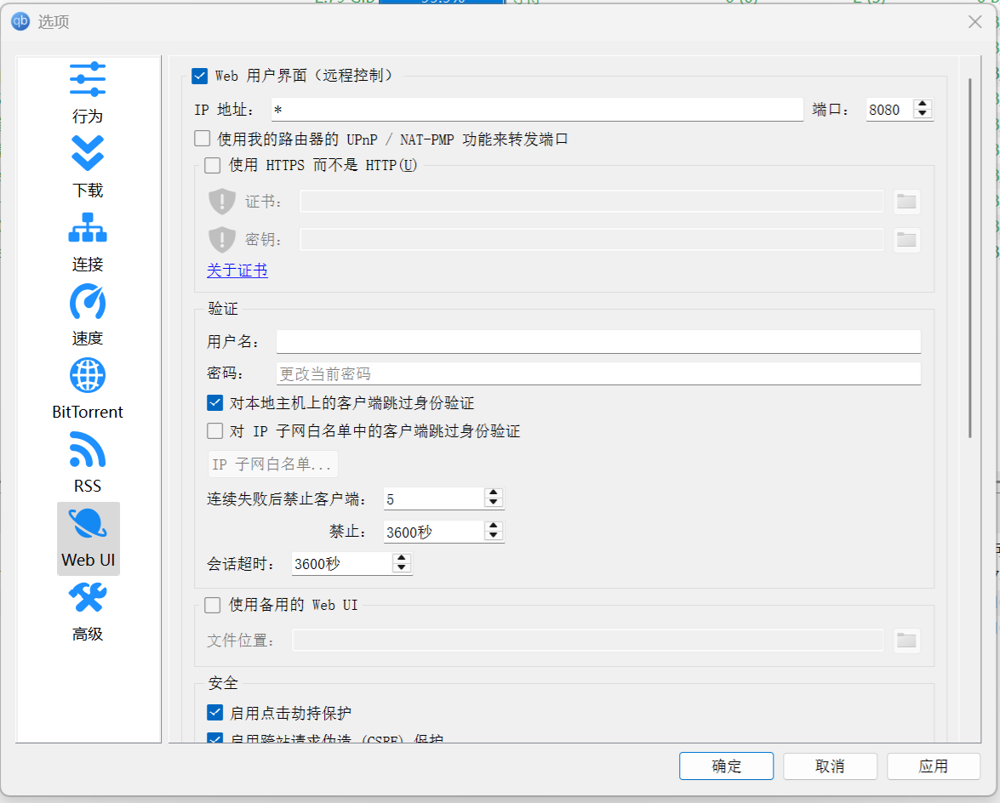
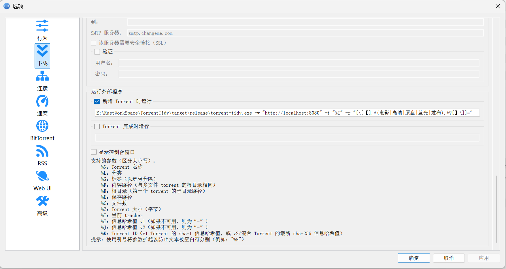
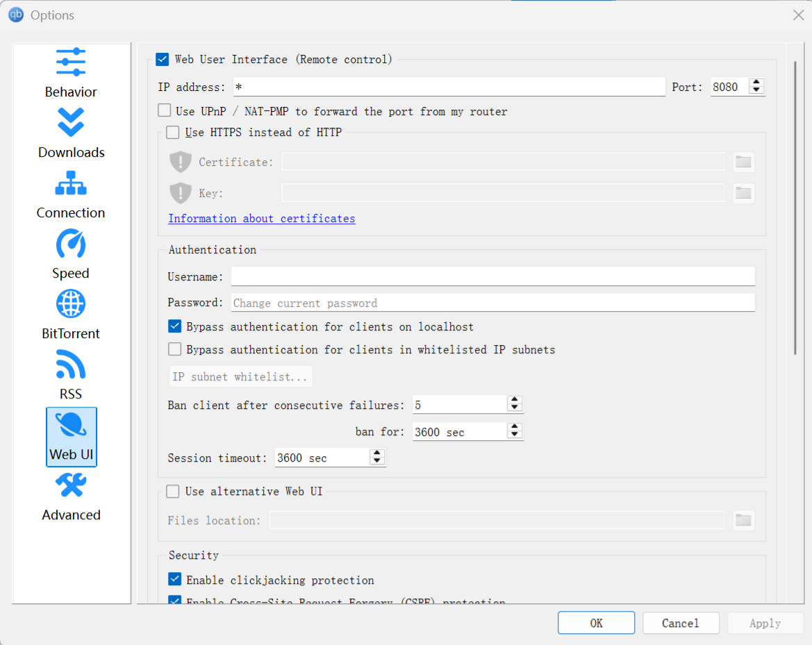

# TorrentTidy 🧹

**简体中文 | [English](#english)**

## 简介

TorrentTidy 是一款为 qBittorrent 设计的轻量级自动化清理工具。它通过正则表达式在下载开始时自动重命名种子和文件，去除文件名中的广告、冗余标识等无关内容，帮你保持媒体库整洁美观。

## 功能特性

*   🚀 **自动化重命名**: 下载触发时立即执行重命名。
*   🔍 **正则表达式替换**: 支持自定义多组正则表达式规则。
*   🔒 **qBit API 集成**: 通过 qBittorrent API 同时修改软件内的任务名称和物理文件。
*   📜 **日志记录**: 可选的文件日志记录，方便追踪操作。

## 🛠️ 安装

### 预编译二进制文件

从 [Release 页面](https://github.com/muyuanjin/TorrentTidy/releases) 下载对应平台的二进制文件。

### 源码编译

```bash
# 克隆项目
git clone https://github.com/muyuanjin/TorrentTidy.git
cd TorrentTidy
# 编译项目
cargo build --release
```

## 🚦 使用方法

### qBittorrent 配置

1.  进入 qBittorrent 的 `Web UI`，勾选 `Web 用户界面（远程控制）`，并记录端口号，例如 `8080`。 如果设置了用户名和密码，同样需要记录。
    
2.  进入 `设置 -> 下载 -> 运行外部程序 -> 新增 Torrent 时运行` 输入框，添加以下内容：
    ```bash
    /path/to/torrent-tidy  -w "http://localhost:8080" -u "用户名" -p "密码" -t "%I" -r "规则1" -r "规则2"
    ```
    如果没有设置用户名和密码，可以省略 `-u` 和 `-p` 参数。
    

### 命令行参数

```text
-w, --webui-url     [必需] qBittorrent WebUI 地址
-t, --torrent-hash  [必需] 种子哈希值 (使用 %I 占位符)
-r, --rename-rules  [必需] 替换规则 (格式: 正则模式=替换文本，或者指向一个文本文件，文件内每两行视为一条规则)，支持多个，不影响文件扩展名
-u, --username      WebUI 用户名，如果设置了用户名密码则需要
-p, --password      WebUI 密码，如果设置了用户名密码则需要
-v, --use-vpn       是否通过 VPN 连接 qBittorrent
-l, --log-file      日志文件路径，如果不设置则不记录日志
```

### 正则规则示例

```bash
# 清理常见发布组标识
-r "[\[【].*?(电影|高清|原盘|蓝光|发布).*?[】\]]="

# 标准化分辨率标识
-r "(2160[pP])=4K" -r "(1080[pP])=FHD"

# 移除广告链接
-r "\s*www\..+?(com|net)\s*="

# 将点替换为空格
-r "\.= "

# 从文件中读取规则，每两行视为一条规则（如果规则在命令行转义下比较难输入，或者与=冲突，或者条目较多的情况下）
-r "file://path/to/rules.txt"
```

## 📸 效果示例

**命令行参数**  

`D:\torrent-tidy.exe -w "http://localhost:8080" -t "%I" -r "[\[【].*(电影|高清|原盘|蓝光|发布).*?[】\]]=" -r "\.= "`  

**处理前**

`【高清影视家园发布 www.XXX.com】小丑2：双重妄想[HDR+杜比视界双版本][中文字幕].2024.2160p.UHD.BluRay.Remux.DV.HEVC.TrueHD7.1-ParkHD`

**处理后**

`小丑2：双重妄想[HDR+杜比视界双版本][中文字幕] 2024 2160p UHD BluRay Remux DV HEVC TrueHD7 1-ParkHD`

## 📄 许可证

MIT License © 2024 Muyuanjin

---

<a name="english"></a>
# English

## Introduction

TorrentTidy is a lightweight automation tool designed for qBittorrent. It intelligently renames torrents and files using regular expression patterns upon download initiation, effectively cleaning advertisements, redundant tags, and irrelevant content in filenames, helping you maintain a clean and tidy media library.

## Features

*   🚀 **Auto-Renaming**: Instant execution upon download trigger.
*   🔍 **Regex Replacement**: Multi-rule customization support.
*   🔒 **qBit API Integration**: Use the qBittorrent API to modify the task name and physical files in the software simultaneously.
*   📜 **Logging**: Optional file logging for operation tracking.

## 🛠️ Installation

### Precompiled binary

Download the binary file of the corresponding platform from the [Release page](https://github.com/muyuanjin/TorrentTidy/releases).

### Build from source

```bash
# Clone the project
git clone https://github.com/muyuanjin/TorrentTidy.git
cd TorrentTidy
# Build the project
cargo build --release
```

## 🚦 Usage

### qBittorrent Configuration

1.  Go to qBittorrent's `Web UI`, check `Web User Interface (Remote Control)`, and note the port number, such as `8080`. If a username and password are set, also record them.
    
2.  Go to `Settings -> Downloads -> Run an External Program -> On Torrent Added` input box and add the following:
    ```bash
    /path/to/torrent-tidy -w "http://localhost:8080" -u "username" -p "password" -t "%I" -r "rule1" -r "rule2"
    ```
    If no username and password are set, you can omit the `-u` and `-p` parameters.
    

### Command line parameters

```text
-w, --webui-url     [Required] qBittorrent WebUI address
-t, --torrent-hash  [Required] Torrent hash (use %I placeholder)
-r, --rename-rules  [Required] Replacement rules (format: regex pattern=replacement text, or point to a text file where every two lines in the file are considered one rule), multiple supported, does not affect the file extension
-u, --username      WebUI username, required if username and password are set
-p, --password      WebUI password, required if username and password are set
-v, --use-vpn       Whether to connect to qBittorrent via VPN
-l, --log-file      Log file path, if not set, no logging will be done
```

### Example of regular rules

```bash
# Clean up common publish group logos
-r "[\[【].*?(电影|高清|原盘|蓝光|发布).*?[】\]]="

# Standardized resolution marking
-r "(2160[pP])=4K" -r "(1080[pP])=FHD"

# Remove ad links
-r "\s*www\..+?(com|net)\s*="

# Replace the dot with a space
-r "\.= "

# Reads rules from a file, with every two lines considered a rule (if the rule is harder to enter with command line escaping, or conflicts with =, or if there are more entries)
-r "file://path/to/rules.txt"
```

## 📸 Torrent Rename Example

**External command**  

`D:\torrent-tidy.exe -w "http://localhost:8080" -t "%I" -r "[\[【].*(movie|Group).*?[】\]]=" -r "\.= "`

**Original Name**

`【Awesome Group - www.example.com】Joker.Folie.a.Deux.2024.2160p.UHD.BluRay.Remux.DV.HEVC.TrueHD7.1-Group.mkv`

**Processed Name**

`Joker: Folie a Deux 2024 2160p UHD BluRay Remux DV HEVC TrueHD7 1-Group.mkv`

## 📄 License

MIT License © 2024 Muyuanjin